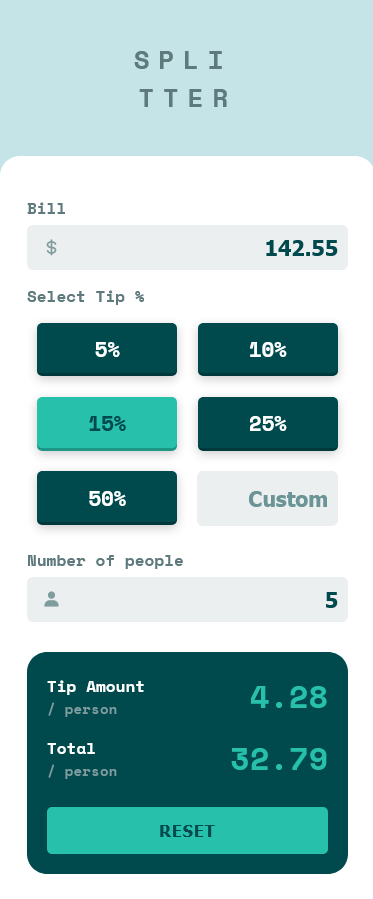

# Frontend Mentor Responsive HTML-CSS-JS - Tip calculator app solution

This is a solution to the [Tip calculator app challenge on Frontend Mentor](https://www.frontendmentor.io/challenges/tip-calculator-app-ugJNGbJUX). 

## Table of contents

- [Overview](#overview)
  - [The challenge](#the-challenge)
  - [Screenshot](#screenshot)
  - [Links](#links)
- [My process](#my-process)
  - [Built with](#built-with)
- [Author](#author)

## Overview

### The challenge

Users should be able to:

- View the optimal layout for the app depending on their device's screen size - status = ✔
- See hover states for all interactive elements on the page - status = ✔
- Calculate the correct tip and total cost of the bill per person - status = ✔

### Screenshot

### Links

- Live Site URL: [Add live site URL here](https://your-live-site-url.com)
- Solution URL: [Add solution URL here](https://your-solution-url.com)

## My process

### Built with

- Semantic HTML5 markup
- CSS custom properties
- Flexbox
- CSS Grid
- Mobile-first workflow

## Author

- Frontend Mentor - [@HugoMoncada](https://www.frontendmentor.io/profile/HugoMoncada)

